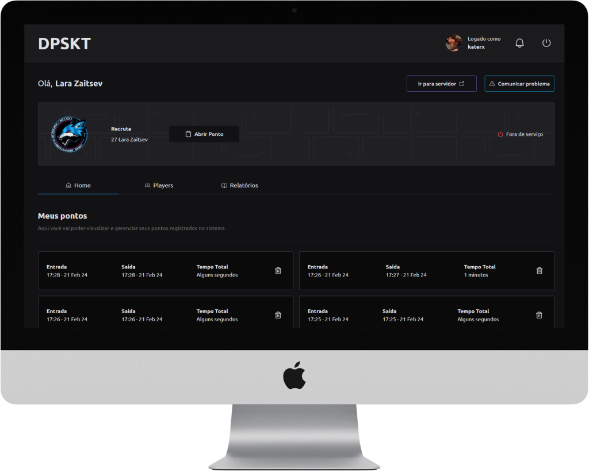

<p align="center">
   
</p>

<br />

<p align="center">	
  
  

  <a href="https://github.com/bkkater/dpskt/commits/master">
    
  </a> 
  
  
</p>

<br />
<br />

# :pushpin: Tabela de Conteúdo

- [Propósito do projeto](#closed_book-propósito-do-projeto)
- [Tecnologias](#computer-tecnologias)
- [Funcionalidades](#rocket-funcionalidades)
- [Figma](#lipstic-figma)
- [Como rodar](#construction_worker-como-rodar)

# :closed_book: Propósito do projeto

O objetivo ao criar este projeto foi desenvolver conhecimentos em Java Spring Boot para a disciplina de Desenvolvimento Web do Instituto Federal Fluminense.

# :computer: Tecnologias

Esse projeto foi feito utilizando as seguintes tecnologias:

<details>
  <summary>Front-end</summary>

- [Spring Boot](https://spring.io/projects/spring-boot)
- [Thymeleaf](https://www.thymeleaf.org/)
- [Tailwind CSS](https://tailwindcss.com/)

</details>

<details>
  <summary>Back-end</summary>

- [Java Spring Boot](https://spring.io/projects/spring-boot)
- [Spring Security](https://spring.io/projects/spring-security)
- [Spring Data JPA](https://spring.io/projects/spring-data)
- [H2 Database](https://www.h2database.com/html/main.html)

</details>

# :rocket: Funcionalidades

- **Registro de Tempo de Patrulha**: Os policiais podem utilizar comandos específicos para iniciar e encerrar seu tempo de patrulha, registrando assim as horas trabalhadas.
- **Gestão de Pessoal**: Os policiais com cargos administrativos têm acesso a comandos para gerenciar os policiais, como promoção, rebaixamento e exoneração.

# :lipstick: Figma

- [Design](<[https://ant.design/](https://www.figma.com/design/RyMKw2xQLhP633pX8Gd05F/DP?node-id=101-115&t=iP8dukPWbkdQ5JfA-1)>)

# :construction_worker: Como rodar

```bash
# Clone o Repositório
$ git clone https://github.com/bkkater/dpskt.git
# Instale as dependências do front-end
$ cd api/src/main/frontend
$ npm install
# Gere os estilos estáticos
$ npm run watch
#Execute o back-end em Java
$ ./mvnw spring-boot:run
```

### 📱 Run Project

# :closed_book: LICENSE

Esse projeto está sobre [MIT license](./LICENSE).
