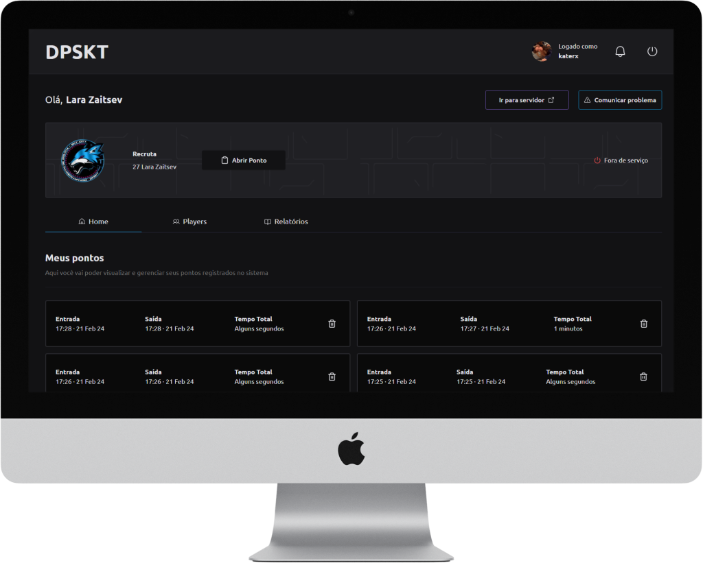

<p align="center">
   <!--  -->
</p>

<br />

<p align="center">	
  
  

  <a href="https://github.com/bkkater/dpskt-web/commits/master">
    
  </a> 
  
</p>

<br />
<br />

# :pushpin: Tabela de Conteúdo

- [Propósito do projeto](#closed_book-propósito-do-projeto)
- [Tecnologias](#computer-tecnologias)
- [Funcionalidades](#rocket-funcionalidades)
- [Repositórios](#computer-repositórios)
- [Como rodar](#construction_worker-como-rodar)

# :closed_book: Propósito do projeto

O objetivo ao criar este projeto foi desenvolver conhecimentos e estudar as mudanças nas tecnologias Next 13, Tanstack Table V8 e explorar algumas utilidades do Tailwind CSS. Este projeto será contínuo e servirá como um Proof of Concept (PoC) para experimentar e testar novas bibliotecas de acordo com o aprendizado adquirido.

Também me desafiei a desenvolver o backend em Node.js e MongoDB, buscando aprofundar meu conhecimento nessas tecnologias e garantir uma integração eficiente com o frontend do projeto.

Para o futuro, planejo implementar testes e refatorar componentes para adotar o Composition Pattern, visando aprimorar a qualidade e a escalabilidade do projeto.

# :computer: Tecnologias

Esse projeto foi feito utilizando as seguintes tecnologias:

<details>
  <summary>Front-end</summary>

- [React](https://pt-br.reactjs.org/)
- [Next.js](https://nextjs.org/)
- [Tailwind CSS](https://tailwindcss.com/)
- [Next-Auth](https://next-auth.js.org/)
- [React Hook Form](https://react-hook-form.com/)
- [Axios](https://www.npmjs.com/package/axios)
- [Date-fns](https://date-fns.org/)
- [Yup](https://www.npmjs.com/package/yup)
- [Ant Design (Antd)](https://ant.design/)

</details>

<details>
  <summary>Back-end</summary>

</details>

# :rocket: Funcionalidades

- **Registro de Tempo de Patrulha**: Os policiais podem utilizar comandos específicos para iniciar e encerrar seu tempo de patrulha, registrando assim as horas trabalhadas.
- **Relatórios**: Os policiais com cargos administrativos podem gerar relatórios com os registros de tempo de patrulha dos policiais, facilitando sua análise e gestão.
- **Gestão de Pessoal**: Os policiais com cargos administrativos têm acesso a comandos para gerenciar os policiais, como promoção, rebaixamento e exoneração.

# :computer: Repositórios

- [WEB]()
- [API]()

# :construction_worker: Como rodar

```bash
# Clone o Repositório
$ git clone https://github.com/bkkater/dpskt.git
```

### 📱 Run Project

```bash

```
